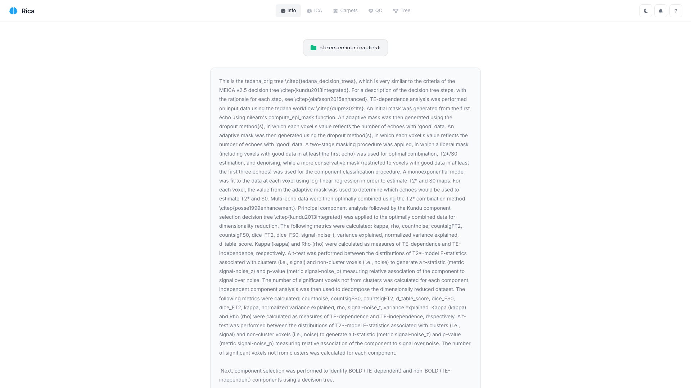
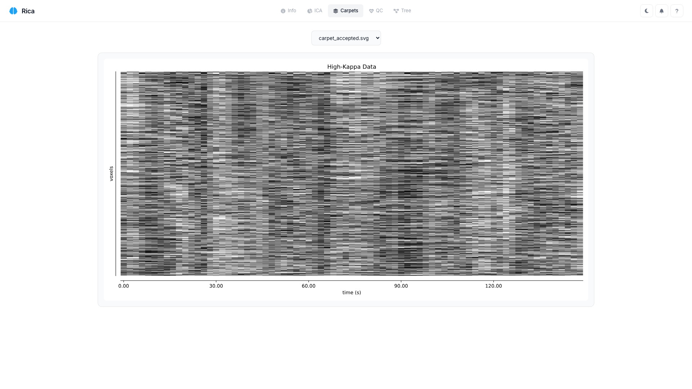
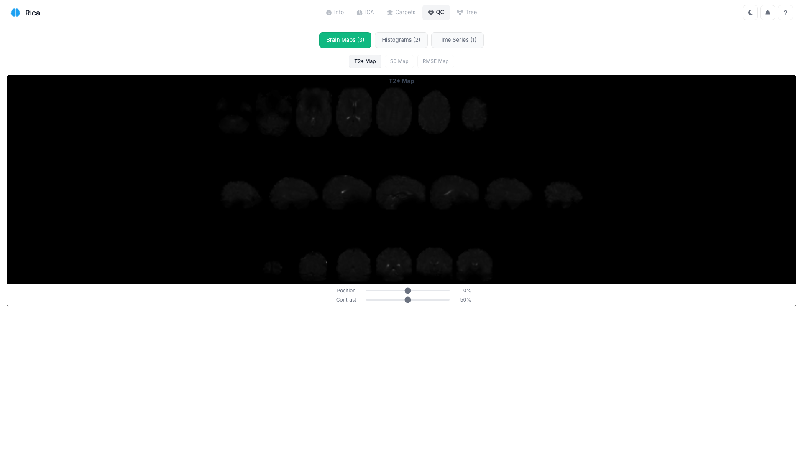
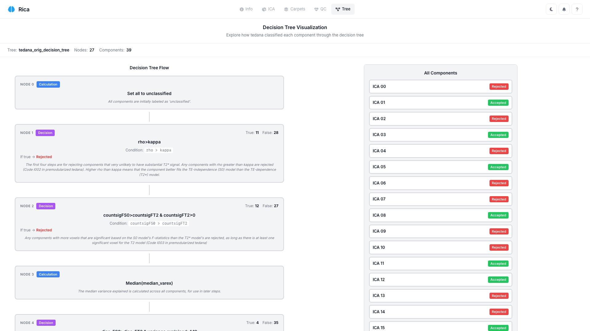

# Interface Overview

Rica's interface is organized into five main tabs, each serving a specific purpose in the component review workflow.

## Navigation Bar

The top navigation bar provides quick access to all features:

| Element | Description |
|---------|-------------|
| **Rica Logo** | Click to return to the start |
| **Tab Buttons** | Switch between Info, ICA, Carpets, QC, and Tree tabs |
| **Theme Toggle** | Switch between light and dark themes |
| **New** | Load a new dataset (hidden in local server mode) |
| **What's New** | View changelog and recent updates |
| **About** | Application info and links |

## The Five Tabs

### Info Tab

The Info tab displays the tedana processing report, providing context about how your data was processed.

**What you'll see:**

- Tedana version used
- Processing parameters
- Input data information
- Selected folder name (hover for full path)

!!! tip
    Review this tab first to understand your data before classifying components.

---

### ICA Tab

The main workspace for component review. This tab contains multiple synchronized visualizations.

**Visualizations:**

| Panel | Description |
|-------|-------------|
| **Kappa/Rho Scatter** | Components plotted by BOLD-like (kappa) vs non-BOLD (rho) metrics |
| **Rank Plots** | Kappa and Rho rank with connecting lines |
| **Pie Chart** | Variance explained by classification category |
| **Brain Viewer** | Interactive 3D component maps (7 slices per orientation) |
| **Time Series** | Component time course from mixing matrix |
| **FFT Spectrum** | Frequency content of component |
| **Component Table** | Sortable table with all metrics |
| **Classification Toggle** | Accept/Reject/Ignore controls |

**Key Features:**

- Click any visualization element to select that component
- All views update synchronously
- Elbow threshold lines show tedana's cutoffs (if available)
- Toggle between static PNG and interactive Niivue views

See [ICA Tab Guide](ica-tab-guide.md) for detailed usage instructions.

---

### Carpets Tab

Displays carpet plot visualizations generated by tedana.

**What you'll see:**

- Dropdown to select different carpet plots
- Large SVG visualization
- Time on x-axis, voxels on y-axis

Carpet plots help identify global signal changes, motion artifacts, and other temporal patterns across voxels.

---

### QC Tab

Quality Control visualizations for assessing data quality.

**Brain Maps:**

| Map | Description |
|-----|-------------|
| **T2*** | T2* relaxation time map |
| **S0** | Signal intensity at TE=0 |
| **RMSE** | Root mean square error map |

**Additional Panels:**

- **Histograms**: Distribution of QC metrics
- **Time Series**: Diagnostic temporal plots

!!! note
    QC maps require the corresponding NIfTI files in your tedana output.

See [QC Tab Guide](qc-tab-guide.md) for interpretation guidance.

---

### Tree Tab

Visualizes tedana's decision tree classification logic.

!!! info "Conditional Tab"
    The Tree tab only appears if `decision_tree.json` and `status_table.tsv` are present in your tedana output.

**What you'll see:**

- Interactive decision tree diagram
- Classification path for each component
- Node criteria and thresholds

This tab helps you understand *why* tedana classified each component the way it did.

## Keyboard Shortcuts

Rica supports keyboard navigation for efficient classification:

| Key | Action |
|-----|--------|
| `A` | Accept current component |
| `R` | Reject current component |
| `←` | Previous component |
| `→` | Next component |

## Theme Support

Rica supports both light and dark themes:

- Click the sun/moon icon in the navigation bar to toggle
- Your preference is saved automatically
- All visualizations adapt to the selected theme

## Responsive Design

Rica is optimized for desktop use. On screens narrower than 1024px, a mobile notice is displayed recommending a larger screen for the best experience.
